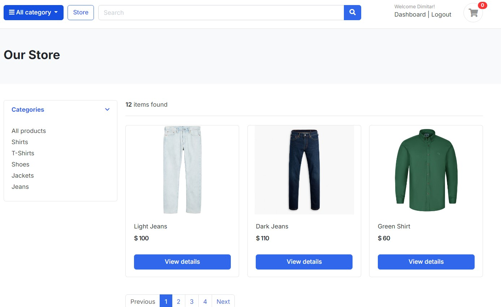
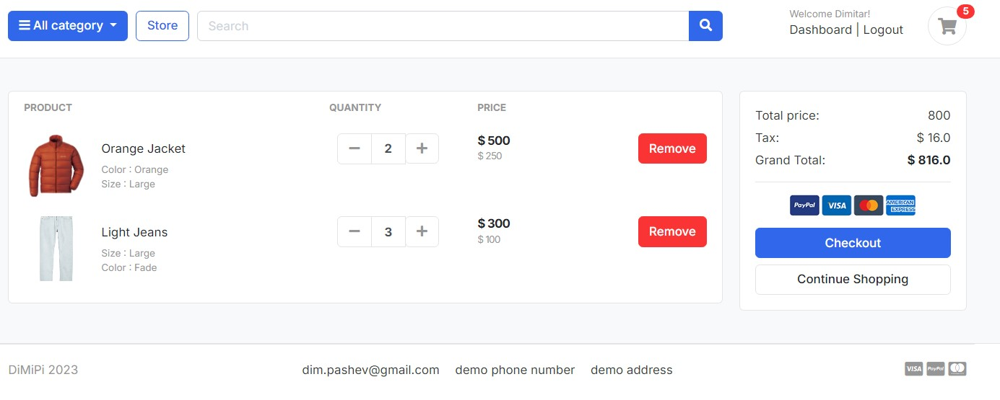
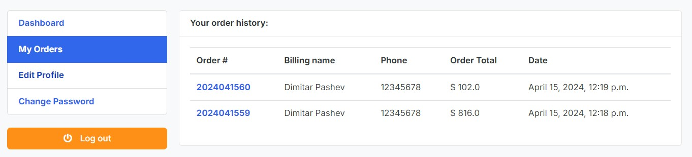
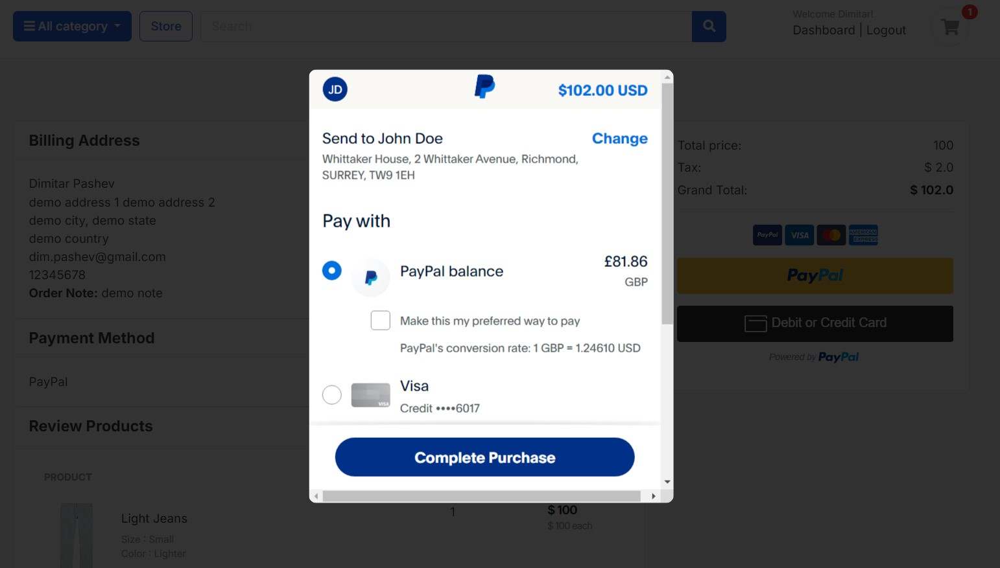
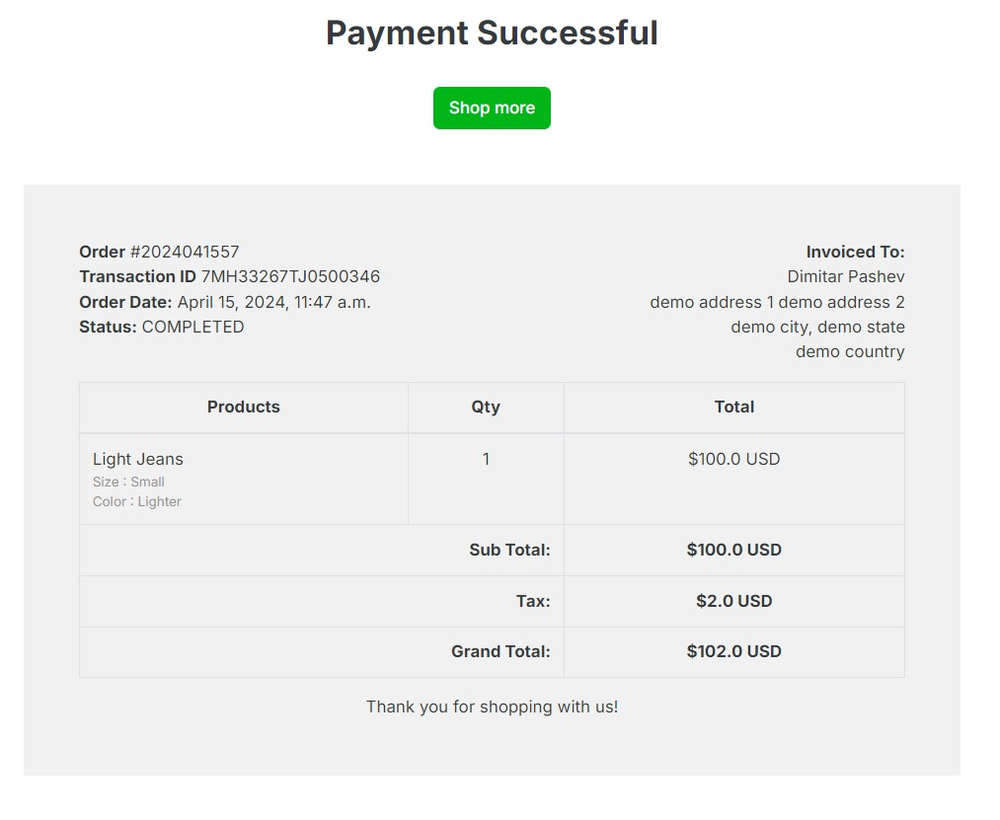
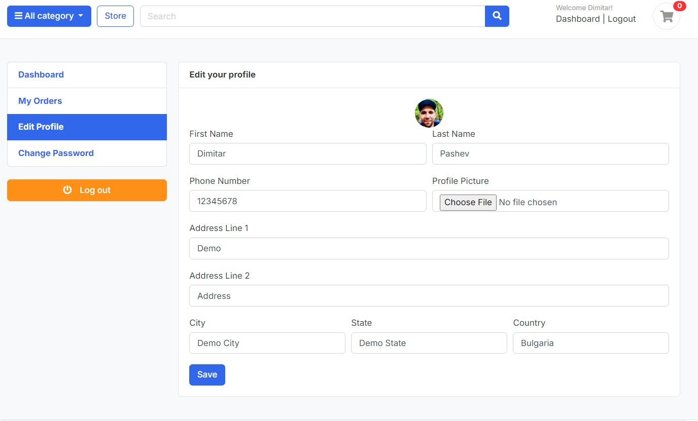
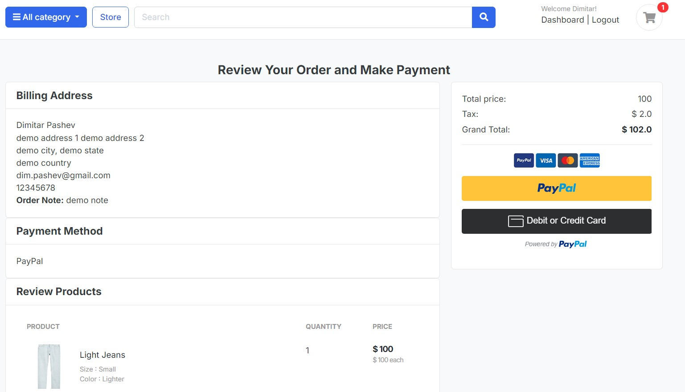
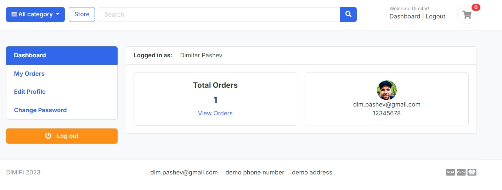

# OnlineShop

OnlineShop is an eCommerce application built using the Python Django framework. It provides a comprehensive set of features for managing an online shopping platform.

## Features

- **Custom User Model**: Allows customization of the user authentication and profile system.
  
- **Categories and Products**: Supports organization and display of products into various categories.
  
  
- **Shopping Cart**: Users can add, increment, decrement, and remove items from their shopping cart.
  
  
- **Order Management**: Handles the order placement process, including payments and post-order functionalities.
  
  
- **PayPal Integration**: Allows customers to securely pay for their orders using PayPal.
  
  
- **Inventory Management**: Automatically reduces the quantity of sold products after an order is completed.
- **Cart Clearing**: Clears the user's cart after a successful order.
- **Order Completion Page**: Provides a summary of the completed order.
  
  
- **User Account Management**: Customers can edit their profiles, update profile pictures, change account passwords, and manage their orders.
  
 
- **Review Payment**: Allows users to review their order details and payment information before finalizing the purchase.
  
  
- **Dashboard**: Provides an overview of the user's order history, account details, and other relevant information.
  
  

## Getting Started

To get a local copy of the project up and running, follow these steps:

1. Clone the repository:
   ```
   git clone https://github.com/dimipash/online_shop_django_project.git
   ```

2. Install the required dependencies:
   ```
   pip install -r requirements.txt
   ```

3. Configure the database settings in `settings.py`.

4. Apply the database migrations:
   ```
   python manage.py migrate
   ```

5. Start the development server:
   ```
   python manage.py runserver
   ```

Now, you can access the application through your web browser at `http://localhost:8000`.